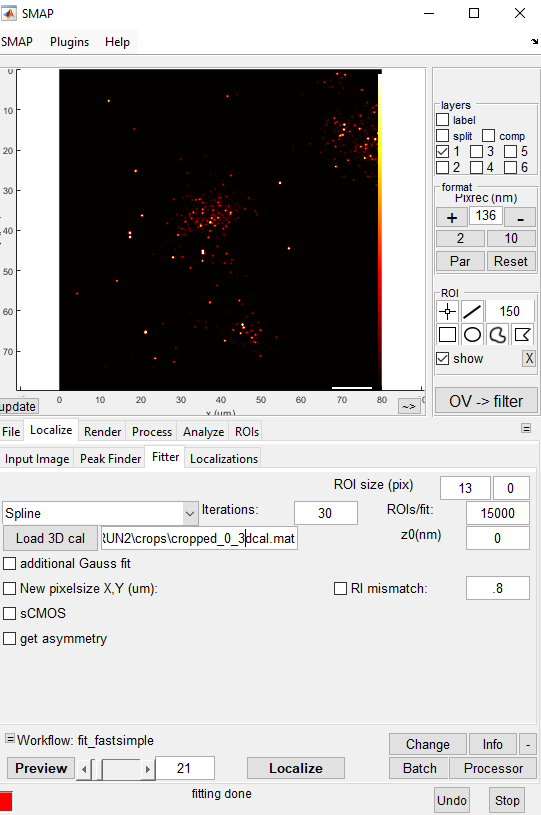
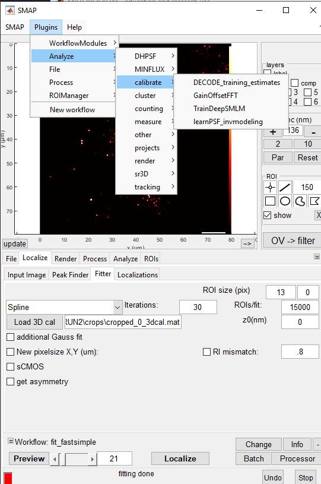
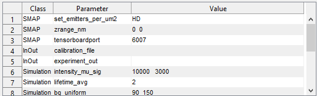
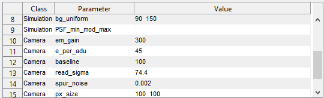
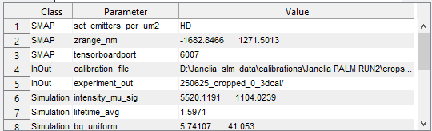
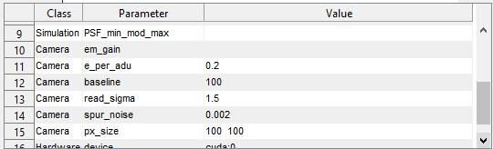

## SMAP localization and DECODE training parameter

1.  It seems the DECODE training parameters plugin needs to have a SML result loaded into SMAP.  Thus SMAP localization is a required preprocessing step to DECODE training parameters. 

2.  It would be nice to have the SMAP results anyway as another comparison group. 

